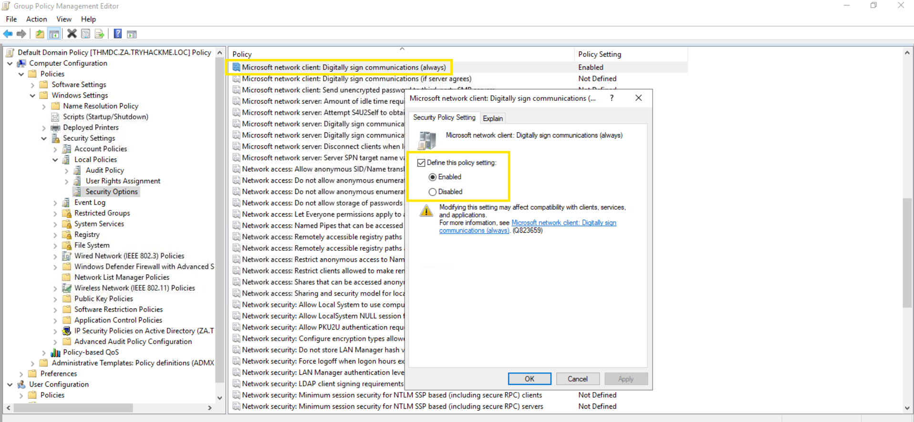
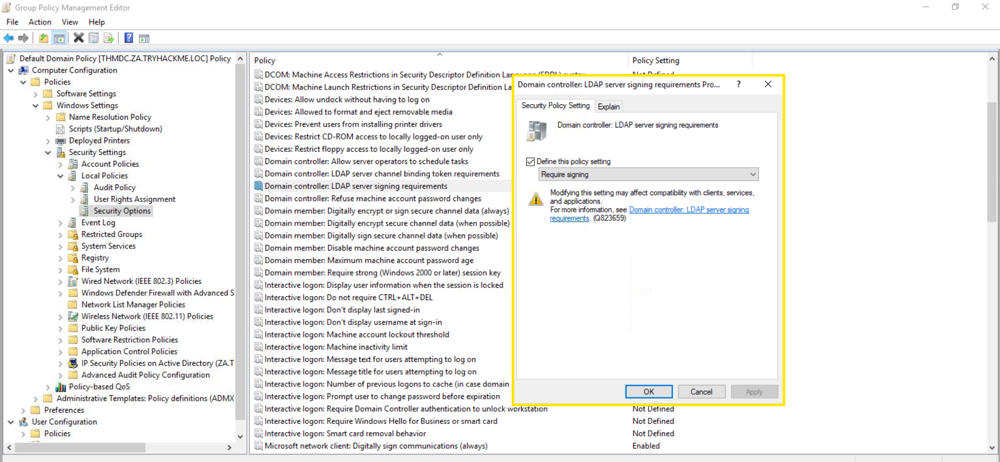
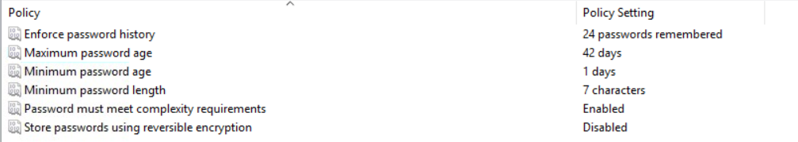

# Active Directory Hardening — Authentification et politiques de sécurité

Cette section regroupe les principaux mécanismes de durcissement étudiés
dans la room TryHackMe *Active Directory Hardening*.

L'objectif est de comprendre comment certaines stratégies de groupe permettent
de réduire l'exposition d'un environnement Active Directory à différentes attaques.

---

## 1. Désactiver le stockage des hash LM

### Pourquoi ?

Windows peut générer différents types de représentations de hash pour les mots de passe.

Le hash **LM (LAN Manager)** est considéré comme plus faible que le hash NT
et peut être plus facilement soumis à des attaques par brute force.

L'objectif est donc d'empêcher Windows de stocker ce type de hash.

### Configuration

Dans l'éditeur de stratégie de groupe :

`Computer Configuration`
→ `Policies`
→ `Windows Settings`
→ `Security Settings`
→ `Local Policies`
→ `Security Options`

Puis ouvrir :

`Network security: Do not store LAN Manager hash value on next password change`

et activer la stratégie.

### Ce que je retiens

La désactivation du stockage des hash LM réduit l'exposition à un mécanisme
de stockage historique considéré comme moins robuste.

> 💡 À noter : la stratégie agit lors du prochain changement de mot de passe.

### Capture

---

## 2. Activer la signature SMB

### Pourquoi ?

SMB (*Server Message Block*) est notamment utilisé dans les environnements
Windows pour le partage de fichiers et d'imprimantes.

La signature SMB permet de vérifier l'intégrité des communications entre
le client et le serveur.

Elle aide notamment à détecter les modifications de trafic pouvant être
réalisées dans le cadre d'une attaque de type **Man-in-the-Middle**.

### Configuration

Dans l'éditeur de stratégie de groupe :

`Computer Configuration`
→ `Policies`
→ `Windows Settings`
→ `Security Settings`
→ `Local Policies`
→ `Security Options`

Puis activer :

`Microsoft network server: Digitally sign communications (always)`

### Ce que je retiens

Sans mécanisme de signature, un attaquant placé entre deux machines peut
potentiellement tenter de modifier le trafic SMB.

La signature SMB permet de vérifier que les échanges n'ont pas été altérés.

### Capture

---

## 3. Exiger la signature LDAP

### Pourquoi ?

LDAP permet notamment de rechercher et d'authentifier des ressources dans
un environnement Active Directory.

La signature LDAP permet de n'accepter que les requêtes LDAP signées,
ce qui contribue à protéger les échanges contre certaines attaques,
notamment de type replay.

### Configuration

Dans l'éditeur de stratégie de groupe :

`Computer Configuration`
→ `Policies`
→ `Windows Settings`
→ `Security Settings`
→ `Local Policies`
→ `Security Options`

Puis ouvrir :

`Domain controller: LDAP server signing requirements`

et sélectionner :

`Require signing`

### Ce que je retiens

Exiger la signature LDAP permet de renforcer la confiance accordée aux
requêtes reçues par les contrôleurs de domaine.

### Capture

---

## 4. Rotation des mots de passe

La rotation des mots de passe peut devenir complexe, notamment pour les
comptes de service.

Plusieurs approches ont été présentées.

### Approche 1 — Automatisation avec PowerShell

Un script PowerShell peut être exécuté automatiquement via une tâche planifiée
afin de mettre à jour régulièrement certains mots de passe.

**Avantage :**
- automatisation du processus.

**Inconvénient :**
- le script doit être développé et maintenu.

### Approche 2 — MFA

L'ajout d'une solution d'authentification multifacteur ajoute une couche de
sécurité supplémentaire.

### Approche 3 — gMSA

Les **Group Managed Service Accounts** permettent de déléguer à Active Directory
la gestion du mot de passe de certains comptes de service.

La rotation du mot de passe est alors automatisée.

### Ce que je retiens

Les comptes de service classiques peuvent devenir problématiques lorsque
leurs mots de passe sont rarement modifiés.

Les gMSA permettent de réduire cette contrainte en automatisant leur gestion.

---

## 5. Politique de mot de passe

Une politique de mot de passe permet de définir les règles appliquées aux
comptes du domaine.

Elle peut notamment limiter certaines attaques telles que :

- brute force ;
- attaques par dictionnaire ;
- password spraying ;
- réutilisation de mots de passe.

### Configuration

Dans l'éditeur de stratégie de groupe :

`Computer Configuration`
→ `Policies`
→ `Windows Settings`
→ `Security Settings`
→ `Account Policies`
→ `Password Policy`

### Paramètres étudiés

#### Password history

Empêche la réutilisation immédiate d'anciens mots de passe.

La room recommande de conserver un historique d'environ **10 à 15 mots de passe**.

#### Minimum password length

La room recommande une longueur minimale comprise entre **10 et 14 caractères**.

#### Complexity requirements

Les mots de passe doivent respecter plusieurs critères de complexité,
notamment en utilisant différentes catégories de caractères.

### Ce que je retiens

Une politique de mot de passe ne repose pas uniquement sur la complexité.

Il faut également prendre en compte :
- la longueur ;
- l'historique ;
- la fréquence de changement ;
- les mécanismes d'authentification complémentaires.

Il vaut mieux se baser sur les recommendations de **l'ANSSI**.

### Capture

