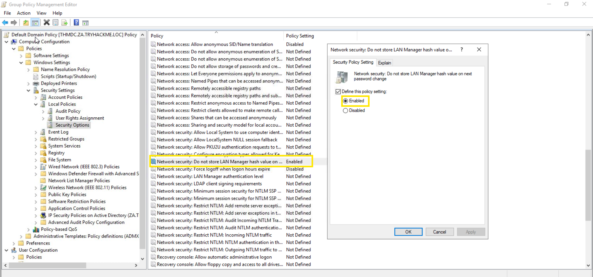

# Active Directory Hardening — Authentification et politiques de sécurité

Cette section regroupe les principaux mécanismes de durcissement étudiés
dans la room TryHackMe *Active Directory Hardening*.

L'objectif est de comprendre comment certaines stratégies de groupe permettent
de réduire l'exposition d'un environnement Active Directory à différentes attaques.

---

## 1. Désactiver le stockage des hash LM

### Pourquoi ?

Windows peut générer différents types de représentations de hash pour les mots de passe.

Le hash **LM (LAN Manager)** est considéré comme plus faible que le hash NT
et peut être plus facilement soumis à des attaques par brute force.

L'objectif est donc d'empêcher Windows de stocker ce type de hash.

### Configuration

Dans l'éditeur de stratégie de groupe :

`Computer Configuration`
→ `Policies`
→ `Windows Settings`
→ `Security Settings`
→ `Local Policies`
→ `Security Options`

Puis ouvrir :

`Network security: Do not store LAN Manager hash value on next password change`

et activer la stratégie.

### Ce que je retiens

La désactivation du stockage des hash LM réduit l'exposition à un mécanisme
de stockage historique considéré comme moins robuste.

> 💡 À noter : la stratégie agit lors du prochain changement de mot de passe.

### Capture

