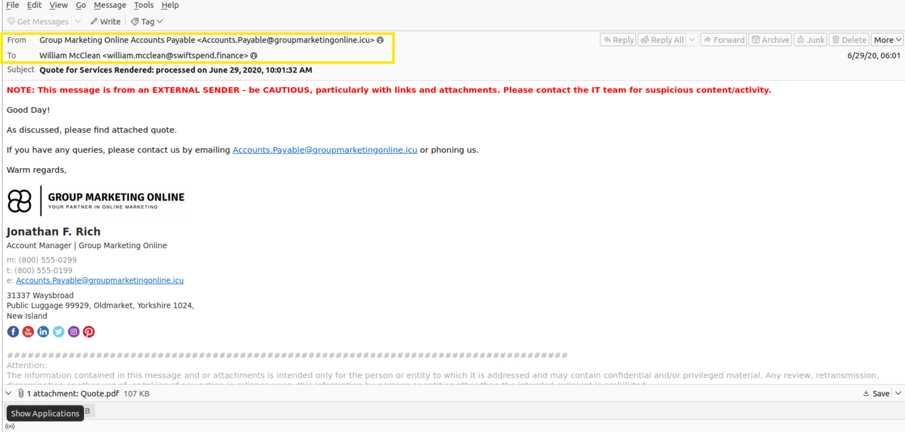
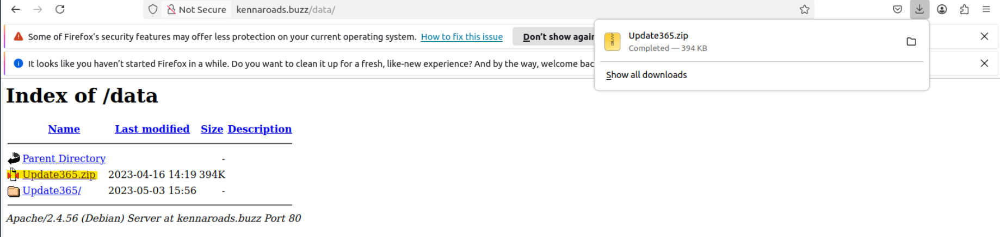
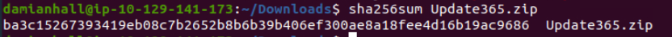
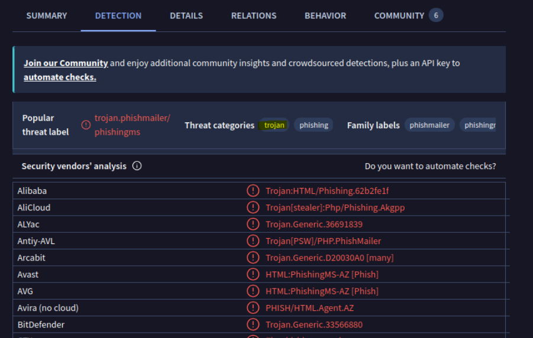
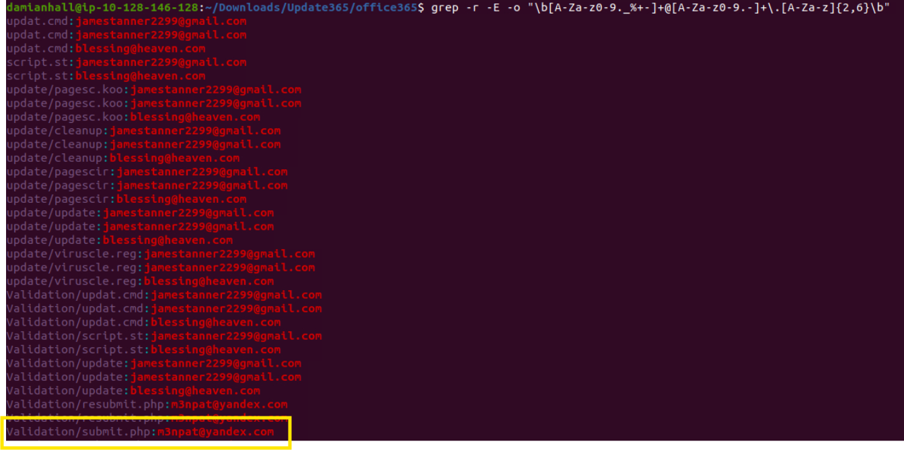

# Investigation d'une campagne de phishing

## Contexte

Dans le cadre du parcours **SOC Level 1 de TryHackMe**, j'ai réalisé une investigation autour d'une campagne de phishing ciblant les employés d'une entreprise fictive du secteur financier.

Plusieurs utilisateurs ont signalé un email suspect et certains ont communiqué leurs identifiants avant de perdre l'accès à leur compte.

L'objectif de ce lab était de comprendre la chaîne d'attaque, d'identifier les artefacts utilisés par l'attaquant et de construire une liste d'indicateurs de compromission exploitables dans le cadre d'une investigation SOC.

> Ce repository contient mes propres notes, analyses et captures réalisées durant le lab.
>
> Il ne contient volontairement pas les réponses aux questions TryHackMe ni les flags de validation.

---

## Compétences travaillées

Au cours de cette investigation, j'ai travaillé sur plusieurs compétences liées à l'analyse de phishing et aux activités SOC :

- analyse d'emails suspects ;
- identification d'indicateurs de compromission ;
- analyse d'URLs et de redirections ;
- analyse de fichiers ;
- calcul et exploitation de hash ;
- utilisation de Threat Intelligence ;
- utilisation de VirusTotal ;
- utilisation de CyberChef ;
- analyse de kits de phishing ;
- compréhension d'une chaîne d'attaque orientée vol d'identifiants.

## Source

Lab réalisé dans le cadre du parcours SOC Level 1 de TryHackMe.
Room utilisée :
Snapped Phish-ing Line
Ce repository est destiné à documenter ma progression et ma compréhension des méthodes d'investigation SOC.
Il ne reproduit pas les solutions complètes, réponses ou flags de la plateforme.

---

## 1. Analyse initiale de l'email

### Objectif

La première étape de l'investigation consistait à analyser les éléments visibles dans l'email afin d'identifier d'éventuels signes de phishing.

### Observations

L'analyse de l'email m'a permis d'identifier plusieurs éléments utiles :
- l'identité du destinataire ;
- l'adresse utilisée par l'expéditeur ;
- le contexte utilisé pour rendre le message crédible ;
- la présence d'un lien dirigeant vers une infrastructure externe.

Une des adresses identifiées dans le scénario était :
```text
Accounts.Payable@groupmarketingonline.icu
```

> Cet artefact provient de l'environnement fictif TryHackMe utilisé dans le lab.

### Ce que j'ai retenu

L'adresse visible d'un expéditeur ne suffit pas à déterminer si un email est légitime.

Dans une investigation réelle, j'essaierais également d'analyser :
- les en-têtes SMTP ;
- le domaine de l'expéditeur ;
- les résultats SPF ;
- les résultats DKIM ;
- la politique DMARC ;
- la cohérence entre le nom affiché et l'adresse réelle ;
- la réputation du domaine ;
- l'âge du domaine ;
- les liens présents dans le corps du message.

### Capture


---

## 2. Analyse de l'URL et des redirections

### Objectif

L'objectif de cette étape était de comprendre vers quelle infrastructure l'utilisateur était dirigé après avoir cliqué sur le lien contenu dans l'email.

### Observation

Le lien contenu dans l'email ne menait pas directement à la destination finale.
L'analyse de la chaîne de redirection a permis d'identifier un domaine utilisé dans l'infrastructure de phishing :
```text
kennaroads.buzz
```

### Pourquoi c'est important

Les campagnes de phishing peuvent utiliser plusieurs niveaux de redirection afin de rendre l'infrastructure moins évidente à identifier.
L'analyse des redirections permet notamment de retrouver :
- l'URL initiale ;
- les domaines intermédiaires ;
- la destination finale ;
- des domaines potentiellement associés à la campagne.

### Ce que j'ai retenu

Lors d'une investigation de phishing, il ne faut pas se limiter au lien visible dans l'email.
Il est important de reconstituer l'ensemble de la chaîne de redirection afin de mieux comprendre l'infrastructure utilisée.
Une analyse plus complète pourrait également inclure :
- la réputation des domaines ;
- les enregistrements DNS ;
- l'historique du domaine ;
- le certificat TLS ;
- les relations entre les différents domaines observés.

---

## 3. Identification de la page de phishing

### Objectif

L'étape suivante consistait à identifier le service ou l'entreprise imitée par la page malveillante.

### Observation

La page utilisée dans le scénario imitait une page de connexion Microsoft.
L'objectif était d'inciter les victimes à saisir leurs identifiants sur une page qui ressemblait à un service légitime.

### Risque

Le phishing ne repose pas nécessairement sur l'exploitation d'une vulnérabilité technique.
Dans ce type de scénario, l'attaquant exploite principalement la confiance de l'utilisateur en reproduisant l'apparence d'un service connu.

### Ce que j'ai retenu

Lors de l'analyse d'une page de phishing, plusieurs éléments peuvent être intéressants :
- le domaine utilisé ;
- la ressemblance avec le domaine officiel ;
- la structure HTML ;
- les formulaires présents ;
- la destination des données saisies ;
- les scripts JavaScript utilisés ;
- les ressources externes chargées par la page.

---

## 4. Analyse du kit de phishing

### Objectif

Une archive liée à l'infrastructure de phishing était exposée et pouvait être analysée.
Cette étape permettait de mieux comprendre les fichiers utilisés pour construire le site de phishing.

L'archive identifiée dans le lab était :
```text
Update365.zip
```

### Capture 


### Calcul du hash

Afin d'identifier précisément le fichier, j'ai calculé son hash SHA-256.
Commande utilisée :
```bash
sha256sum Update365.zip
```

Le hash obtenu dans le scénario était :
```text
ba3c15267393419eb08c7b2652b8b6b39b406ef300ae8a18fee4d16b19ac9686
```

### Pourquoi calculer un hash ?

Un hash cryptographique permet d'identifier un fichier de manière précise.
Dans une investigation, il peut notamment servir à :
- rechercher un fichier dans une plateforme de Threat Intelligence ;
- comparer un échantillon avec d'autres investigations ;
- partager un IOC avec une autre équipe ;
- vérifier si le même fichier a déjà été observé ailleurs.

### Capture



---

## 5. Analyse avec VirusTotal

### Objectif

Le hash obtenu a ensuite été utilisé afin d'enrichir l'investigation avec une plateforme de Threat Intelligence.

### Observation

L'archive était associée à plusieurs catégories malveillantes.
Dans le scénario, elle était notamment identifiée comme liée au phishing et à une activité de type Trojan.

### Ce que j'ai retenu

VirusTotal peut être très utile pour enrichir une investigation, mais ses résultats doivent être interprétés avec prudence.
Un résultat VirusTotal ne doit pas être considéré comme une preuve absolue.

Il permet cependant de :
- consulter les détections de plusieurs moteurs ;
- vérifier la réputation d'un fichier ;
- rechercher un hash ;
- identifier d'autres artefacts associés ;
- enrichir une liste d'IOC.

### Capture


---

## 6. Analyse du contenu du kit

### Objectif

L'analyse du contenu de l'archive permettait de mieux comprendre le fonctionnement du kit de phishing.
Le kit contenait plusieurs dizaines de fichiers.

L'objectif n'était pas seulement de compter ces fichiers, mais surtout d'identifier les éléments permettant de comprendre comment les identifiants étaient collectés.

### Observation

L'analyse du kit a permis d'identifier une adresse utilisée pour recevoir des identifiants compromis :
```text
m3npat@yandex.com
```

### Ce que j'ai retenu

L'analyse du code source d'un kit de phishing peut révéler de nombreux artefacts utiles à une investigation :
- adresses email ;
- URLs ;
- domaines ;
- chemins ;
- paramètres ;
- scripts ;
- mécanismes d'exfiltration.

Ces éléments peuvent ensuite être utilisés comme IOC ou comme point de départ pour approfondir l'investigation.

### Capture


---

## 7. Analyse des identifiants compromis

### Objectif

Une partie du scénario permettait d'identifier les utilisateurs ayant soumis leurs identifiants sur la fausse page de connexion.

Cette étape permettait de comprendre l'impact de la campagne de phishing.

### Ce que j'ai retenu

Dans une investigation réelle, l'identification d'un compte ayant soumis ses identifiants serait un élément critique.

Cela pourrait nécessiter plusieurs actions de réponse :
- réinitialisation du mot de passe ;
- révocation des sessions actives ;
- vérification de l'authentification multifacteur ;
- analyse des connexions récentes ;
- recherche d'activités suspectes ;
- vérification de l'utilisation du compte sur d'autres services.

Cette étape m'a permis de comprendre que l'analyse d'un phishing ne s'arrête pas à l'identification de l'email malveillant.
Il faut également chercher à déterminer son impact sur les utilisateurs et sur l'environnement.

---

## 8. Utilisation de CyberChef

### Objectif

CyberChef a été utilisé durant le lab afin de décoder une valeur présente dans les données analysées.
Je ne publie volontairement pas le flag associé au challenge.

### Ce que j'ai retenu

CyberChef est un outil utile pour manipuler rapidement différents types de données.
Il peut notamment être utilisé pour :
- décoder du Base64 ;
- décoder des URLs ;
- convertir de l'hexadécimal ;
- manipuler des chaînes de caractères ;
- calculer ou analyser certains hashes ;
- appliquer plusieurs transformations successives.

---

## 9. Indicateurs de compromission

Les différents artefacts identifiés durant le lab peuvent être synthétisés sous forme d'IOC.

| Type	| Valeur	| Contexte |
| Adresse email	| `Accounts.Payable@groupmarketingonline.icu`	| Adresse utilisée pour l'envoi du phishing |
| Domaine	| `kennaroads.buzz`	| Infrastructure de redirection |
| Fichier |	`Update365.zip`	| Archive associée au kit de phishing |
| SHA-256 |	`ba3c15267393419eb08c7b2652b8b6b39b406ef300ae8a18fee4d16b19ac9686` |	Empreinte de l'archive |
| Adresse email |	`m3npat@yandex.com`	| Adresse utilisée pour collecter les identifiants |

> Tous les indicateurs présents dans cette section proviennent de l'environnement fictif du lab TryHackMe.

---

## 10. Reconstruction de la chaîne d'attaque

L'ensemble des éléments analysés permet de reconstruire une chaîne d'attaque simplifiée.
```text
Email de phishing
        ↓
Lien malveillant
        ↓
Redirection
        ↓
Fausse page de connexion Microsoft
        ↓
Saisie des identifiants
        ↓
Collecte des credentials
```

Cette représentation m'a permis de mieux comprendre comment plusieurs artefacts apparemment indépendants peuvent être reliés entre eux afin de reconstruire une campagne de phishing.

---

## 11. Résultats de l'investigation

Cette investigation m'a permis de :
- identifier une campagne de phishing ciblée ;
- retrouver l'adresse utilisée pour envoyer les emails ;
- analyser une chaîne de redirection ;
- identifier une page imitant un service Microsoft ;
- analyser une archive liée à un kit de phishing ;
- calculer le hash SHA-256 d'un fichier ;
- utiliser VirusTotal pour enrichir l'analyse ;
- identifier des IOC exploitables ;
- comprendre le mécanisme de collecte des identifiants ;
- utiliser CyberChef pour décoder des données.

---

## 12. Ce que ce lab m'a apporté

Ce lab m'a permis de travailler une démarche d'investigation plus complète qu'une simple analyse visuelle d'un email suspect.

J'ai appris à relier plusieurs types d'artefacts :
- email ;
- URL ;
- domaine ;
- fichier ;
- hash ;
- page de phishing ;
- infrastructure de collecte ;
- identifiants compromis.

L'un des principaux enseignements que j'en retiens est qu'un IOC pris isolément apporte relativement peu de contexte.

C'est la corrélation entre les différents artefacts qui permet de mieux comprendre l'activité observée et de reconstruire la chaîne d'attaque.

---

## 13. Points à approfondir

À la suite de ce lab, je souhaite approfondir plusieurs sujets :
- analyse complète des en-têtes SMTP ;
- fonctionnement de SPF, DKIM et DMARC ;
- analyse automatique des URLs ;
- extraction automatisée d'IOC ;
- analyse statique de kits de phishing ;
- création de règles Sigma ;
- investigation de phishing dans un SIEM ;
- automatisation de l'enrichissement Threat Intelligence ;
- analyse de fichiers suspects dans un environnement isolé.
