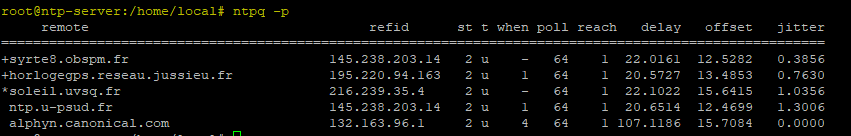

# Commandes utiles serveur NTP

## La commande ntpq -p
La commande ntpq -p est utilisée pour afficher l'état de synchronisation et des pairs (peers) d'un serveur NTP. 
Elle fournit des informations essentielles sur les serveurs NTP avec lesquels votre serveur est en communication.



### Signification des colonnes
- remote : les serveurs NTP spéficié dans le fichier /etc/ntp.conf
- refid : la source actuelle de synchronisation pour l'hôte distant
- st (stratum) : Niveau de hiérarchie du serveur.
  - 1 : Serveur connecté directement à une horloge de référence (comme une horloge atomique)
  - 2 ou plus : Serveur synchronisé à un autre serveur NTP
- t (Type de serveur) :
  - u : Unicast
  - m : Multicast
  - l : Local
- when : temps écoulé depuis le dernier échange avec ce pair (en secondes)
- poll : intervalle de temps entre deux requêtes au serveur (en secondes)
- reach : indique la réussite/echec pour atteindre la source
  - 377 indique que toutes les tentatives ont réussi
- delay : Temps aller-retour moyen des paquets (en millisecondes)
- offset : Différence entre l'horloge locale et l'horloge du serveur distant (en millisecondes)
  - Une valeur proche de 0 est idéale
- disp/jitter : indique la différence entre le serveur client et la source (en millisecondes)
  - Une faible valeur indique une bonne stabilité temporelle.
 
### Signification des symboles en début de ligne
```bash
* : Le serveur actuellement sélectionné comme source de synchronisation.
+ : Serveurs utilisables, mais pas sélectionnés comme source principale.
- : Serveurs rejetés.
x : Serveurs marqués comme défaillants
```

## 🔗 Ressources associées

Cette commande est utilisée par le script de supervision suivant :

👉 [Voir le script check_ntp_sync.sh](../monitoring/scripts/ntp-check/check_ntp_sync.sh)

Pour la mise en place complète d'un serveur NTP :

👉 [Voir l'installation du serveur NTP](installation.md)
